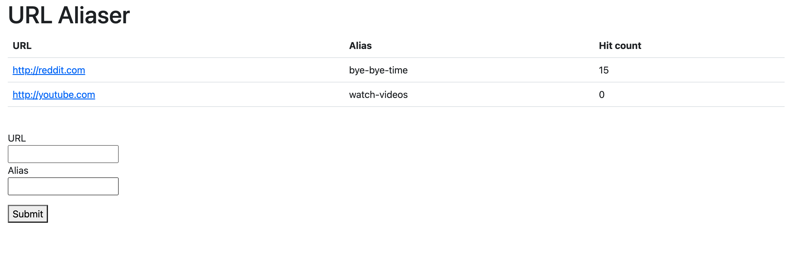
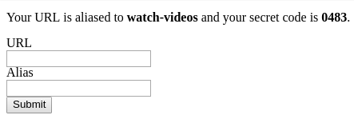
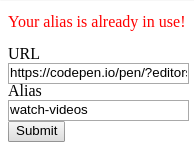

# URL aliaser

We are going to create something like a [URL shortening](https://en.wikipedia.org/wiki/URL_shortening)
application, but we are not going to struggle with random strings rather we will
create a *"URL aliasing application"*.

**Read the whole description in order to understand the application.**

## Database

Create a database named `url_aliaser`.
There should be 2 tables in the database:
- `links`
- `aliases`

The `links` table should have at least the following columns:
- `id` - auto-incrementing integer
- `url` - string

The `aliases` table should have at least the following columns:
- `id` - auto-incrementing integer
- `alias` - string
- `hitCount` - integer
- `secretCode` - string

A `link` could have multiple `aliases`, but an `alias` can only belong to one `link`.
Set up the ORM (Entities) to reflect this relationship.

## `GET /`
- The main page should be rendered
- It should list all the aliases with the following columns:
  - `URL`
  - `Alias`
  - `Hit count`
- It should contain a form with we can add new aliases
  - It should have a link dropdown which lists all the links
  - It should have an input field for the alias
  - It should have a submit button
- The form should be submitted to `POST /save-link`

### The main page has 3 scenarios

#### Default


#### Success
- It should show the message "Your URL is aliased to {alias} and your
  secret code is {secret code}."
- It should clear the input fields



#### Error
- It should show the default view
- It should show the message "Your alias is already in use!"
- It should **not** clear the input fields



## `POST /save-link`
- If the alias is already in use redirect to the main page with the error scenario
- Else
  - Generate a secret code which is just a random 4-digit string consisting of numbers
    - Store the entries in the database
    - If the link is already in the database add the new alias to the existing entry
    - Redirect to the main page with the success scenario

## `GET /a/{alias}`
- If the alias exists it should increment the hit count and redirect to the URL
  otherwise respond with 404 status code

## `GET /api/aliases`
- It should respond with the stored entries in the following JSON format
- Note that the secret code is not included
  ```json
  [
    {
      "id": 1,
      "url": "http://reddit.com",
      "alias": "bye-bye-time",
      "hitCount": 0
    },
    {
      "id": 2,
      "url": "http://youtube.com",
      "alias": "watch-videos",
      "hitCount": 4
    },
    {
      "id": 3,
      "url": "http://reddit.com",
      "alias": "another-time",
      "hitCount": 0
    }
  ]
  ```

## `DELETE /api/aliases/{id}`
- The secret code should be in the request's body in JSON format
  ```json
  {
    "secretCode": "0483"
  }
  ```
- If the link doesn't exist respond with 404 status code
- If it exists but the provided secret code doesn't match respond with 403
  status code
- If it exists and the provided secret code matches delete the entry from the
  database and respond with 204 status code

# SQL

Given the following table named `applicants`.

| id | name               | country        | age |
|:---|:-------------------|:---------------|:----|
| 0  | Bořivoj Souček     | Czech Republic | 24  |
| 1  | Papp Patrícia      | Hungary        | 33  |
| 2  | Kocsis Ivett       | Hungary        | 37  |
| 3  | Slavomír Vykukal   | Czech Republic | 20  |
| 4  | Bruno Malík        | Czech Republic | 31  |
| 5  | Veronika Lukešová  | Czech Republic | 18  |
| 6  | Székely Miklós     | Hungary        | 29  |
| 7  | Hegedüs Benjámin   | Hungary        | 37  |
| 8  | Nela Machová       | Czech Republic | 20  |
| 9  | Balog Rajmund      | Hungary        | 39  |
| 10 | Major Borbála      | Hungary        | 35  |
| 11 | Evelína Horváthová | Czech Republic | 23  |
| 12 | Vászoly Vivien     | Hungary        | 40  |
| 13 | Lada Stýskalová    | Czech Republic | 27  |
| 14 | Dagmar Benešová    | Czech Republic | 33  |

- Write an SQL query to select the name of the 5 youngest applicants from the
  Czech Republic.
- Count the number of applicants from Hungary who are aged 35 and above.
- Retrieve the names of all applicants who have a name starting with the letter 'B'.
- Determine the average age of applicants from each country.
