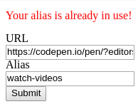

# URL aliaser

We are going to create something like a [URL shortening](https://en.wikipedia.org/wiki/URL_shortening)
application but we are not going to struggle with random strings rather we will
create a *"URL aliasing application"*.

**Read the whole description in order to understand the application.**

## `GET /`
- The main page should be rendered
- It should contain a form with two labels, two input fields and a submit button
- The form should be submitted to `POST /api/links`
- Based on the response display the error or the success scenario

### The main page has 3 scenarios

#### Default


#### Success
- It should show the message "Your URL is aliased to {alias} and your
  secret code is {secret code}."
- It should clear the input fields


#### Error
- It should show the default view
- It should show the message "Your alias is already in use!"
- It should **not** clear the input fields



## `POST /api/links`
- If the alias is already in use respond with 400 status code
- Else
  - Generate a secret code which is just a random 4 character long string consisting of numeric characters
  - Store the entry in the database
  - It should respond with the stored entry in the following JSON format
    ```json
    {
      "id": 0,
      "url": "http://reddit.com",
      "alias": "bye-bye-time",
      "hitCount": 0,
      "secretCode": "0483"
    }
    ```

## `GET /a/{alias}`
- If the alias exists it should increment the hit count and redirect to the URL
  otherwise respond with 404 status code

## `GET /api/links`
- It should respond with the stored entries in the following JSON format
- Note that the secret code is not included
  ```json
  [
    {
      "id": 0,
      "url": "http://reddit.com",
      "alias": "bye-bye-time",
      "hitCount": 0
    },
    {
      "id": 1,
      "url": "http://youtube.com",
      "alias": "watch-videos",
      "hitCount": 4
    }
  ]
  ```

## `DELETE /api/links/{id}`
- The secret code should be in the request's body in JSON format
  ```json
  {
    "secretCode": "0483"
  }
  ```
- If the link doesn't exist respond with 404 status code
- If it exists but the provided secret code doesn't match respond with 403
  status code
- If it exists and the provided secret code matches delete the entry from the
  database and respond with 204 status code

# Question

Given the following table named `applicants`.

| id | name               | country        | age |
|:---|:-------------------|:---------------|:----|
| 0  | Bořivoj Souček     | Czech Republic | 24  |
| 1  | Papp Patrícia      | Hungary        | 33  |
| 2  | Kocsis Ivett       | Hungary        | 37  |
| 3  | Slavomír Vykukal   | Czech Republic | 20  |
| 4  | Bruno Malík        | Czech Republic | 31  |
| 5  | Veronika Lukešová  | Czech Republic | 18  |
| 6  | Székely Miklós     | Hungary        | 29  |
| 7  | Hegedüs Benjámin   | Hungary        | 37  |
| 8  | Nela Machová       | Czech Republic | 20  |
| 9  | Balog Rajmund      | Hungary        | 39  |
| 10 | Major Borbála      | Hungary        | 35  |
| 11 | Evelína Horváthová | Czech Republic | 23  |
| 12 | Vászoly Vivien     | Hungary        | 40  |
| 13 | Lada Stýskalová    | Czech Republic | 27  |
| 14 | Dagmar Benešová    | Czech Republic | 33  |

Write an SQL query to select the name of the 5 youngest applicants from the
Czech Republic.
